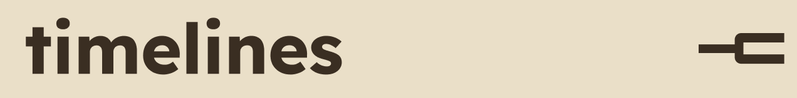
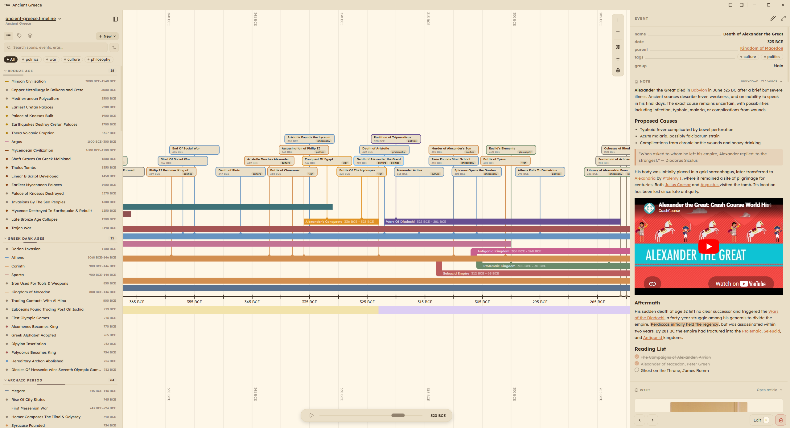
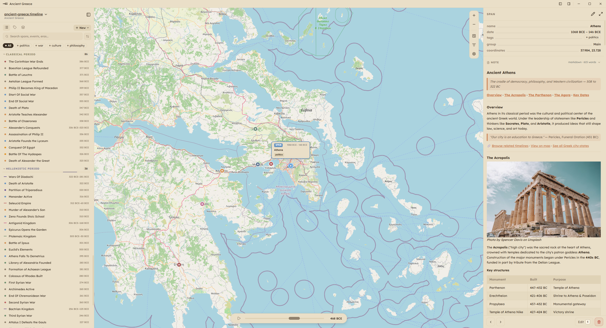

# 


Timelines Studio is a free, open-source app for creating customizable, interactive timelines for worldbuilding and history. Organize events, spans, and eras with tags and groups, link Markdown notes or MediaWiki sources directly to elements, and visualize timelines geographically with map view and coordinate support.

**Local-first.** Everything lives on your device as plain `.timeline` (JSON) and `.md` files: no account, no cloud, no lock-in.

**Download the [latest release](https://github.com/sreegjl/timelines/releases)** for Windows and macOS.

[](#)
[](#)
[](https://www.gnu.org/licenses/gpl-3.0)

[Website](https://www.timelines.studio/) · [Gallery](https://www.timelines.studio/gallery) · [Wiki](https://github.com/sreegjl/timelines/wiki) · [Feature Suggestions & Roadmap](https://github.com/sreegjl/timelines/issues/8)





## Features

- **Events, spans & eras:** pin dated moments and customize them with thumbnail images and icons, draw periods that can branch from or merge into other spans, and wrap stretches of time into named eras that wash across the whole canvas.
- **Tags & groups:** organize elements and filter the canvas to just what you're working on.
- **Notes & sources:** attach Markdown notes, sources, and MediaWiki content directly to timeline elements, and connect the notes folder to an existing vault (like Obsidian) to keep your research beside the timeline.
- **Map view:** give any event or span coordinates and watch your timeline unfold across geography.
- **Spreadsheet view:** flip the whole canvas into a sortable table to edit dates, rename entries, and bulk-fix details.
- **Themes:** browse a [marketplace](https://github.com/sreegjl/timelines-marketplace) of 100+ community themes, set a different theme per timeline, or recolor the entire app.
- **Local-first:** everything is stored on your device as plain `.timeline` and `.md` files. Free and open source under GPL-3.0.
- **Web viewer:** open any `.timeline` file in the browser at [timelines.studio/viewer](https://www.timelines.studio/viewer), and if the file lives in a GitHub repo, paste its link to get a shareable URL anyone can view without installing the app.

## Installing

Download the installer for your platform from the [Releases page](https://github.com/sreegjl/timelines/releases).

## Data

Timelines are stored as `.timeline` JSON files and notes as `.md` files. By default these live in your system app data folder. You can point to a custom directory in app settings.

## Setup

**Prerequisites:** [Node.js LTS](https://nodejs.org/)

**1. Clone the repo**
```bash
git clone https://github.com/sreegjl/timelines.git

cd timelines
```

**2. Install dependencies**
```bash
npm install
```

## Development

**Start the app:**
```bash
npm run electron:dev
```

> [!NOTE]
> App performance is worse in dev mode. Use it to test changes, and build the app for regular use.

## Building

**Build the Electron app installer:**
```bash
npm run electron:build
```

The output installer will be in the `release/` folder.

<!--  -->
